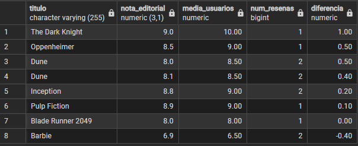

## PASO 1: Pregunta: ¿Por qué usamos LEFT JOIN en lugar de INNER JOIN? ¿Qué filas se perderían con INNER JOIN?

Porque queremos traer todas las peliculas aunque no tengan director ni genero.

## PASO 5: Pregunta: ¿Qué películas tienen usuarios más entusiastas que la crítica? ¿Y al revés?

Sobre todo The Dark knight que la crítica lo califico con un 9.0 y los usuarios con un 10.00. Pero le siguen otras 5 peliculas más donde los usuarios dieron mas puntuación que la crítica de profesionales:

La query:

WITH medias_usuarios AS (
  SELECT
    pelicula_id,
    ROUND(AVG(puntuacion), 2) AS media_usuarios,
    COUNT(*) AS num_resenas
  FROM resenas
  GROUP BY pelicula_id
),
comparacion AS (
  SELECT
    p.titulo,
    p.nota AS nota_editorial,
    mu.media_usuarios,
    mu.num_resenas,
    ROUND(mu.media_usuarios - p.nota, 2) AS diferencia
  FROM peliculas p
  JOIN medias_usuarios mu ON mu.pelicula_id = p.id
)
SELECT *
FROM comparacion
ORDER BY diferencia DESC;

Resultado:

